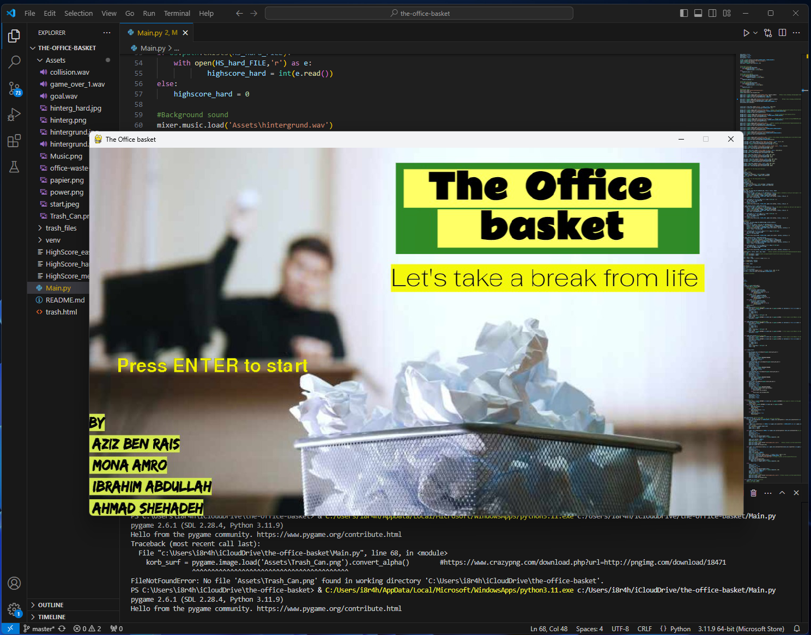
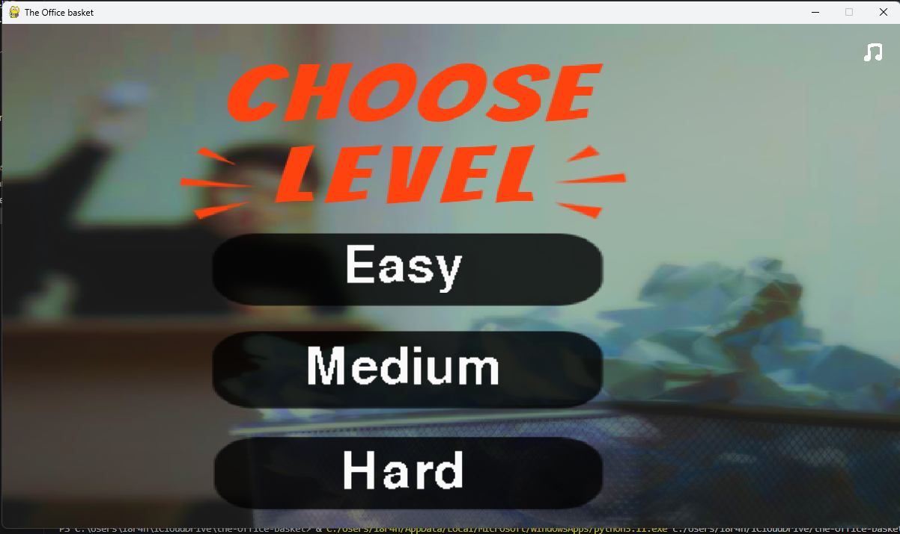
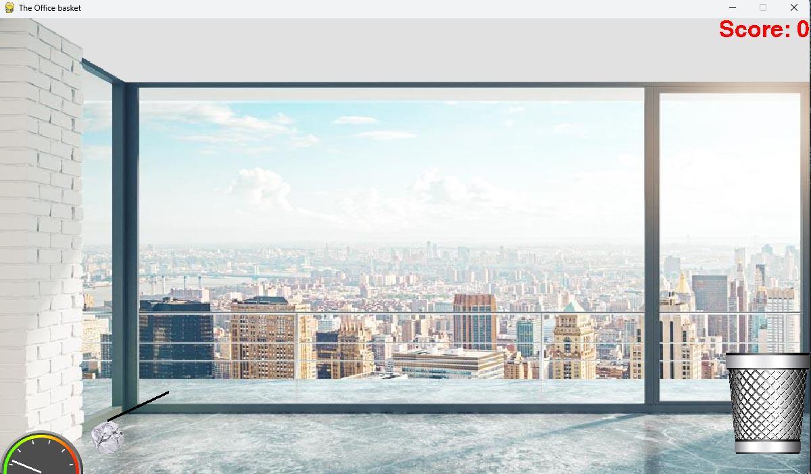
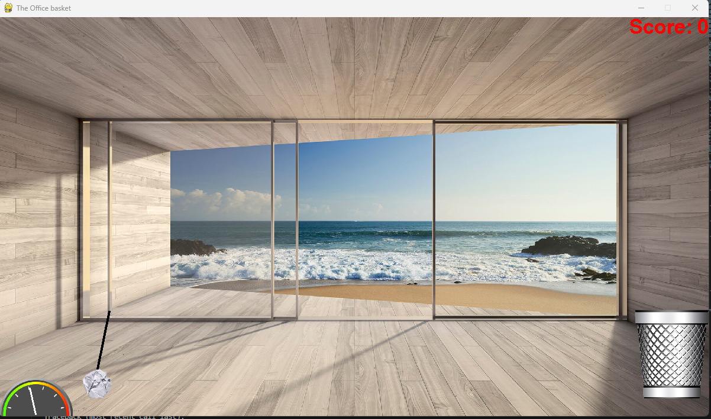

# The Office Basket 🗑️

Welcome to **The Office Basket**, a fun physics-based arcade game where you aim to toss crumpled paper into a trash bin! Test your precision and timing skills across different difficulty levels. 🎮

---

## About the Project

This project was created as part of the **University of Clausthal** coursework by the following contributors:

- **Aziz Ben Rais**
- **Mona Amro**
- **Ibrahim Abdullah**
- **Ahmad Shehadeh**

It was developed to showcase teamwork, creativity, and problem-solving skills in an interactive way.

---

## Features
- **Three Difficulty Levels**: Easy, Medium, and Hard to challenge players of all skill levels.
- **Realistic Physics**: Feel the thrill of accurately throwing paper.
- **Custom Backgrounds**: Immerse yourself in visually engaging office settings.
- **Sound Effects**: Enjoy satisfying audio for your throws, collisions, and scores.
- **High Score Tracker**: Beat your best score and challenge your friends.

---

## Gameplay Preview

### Screenshots

#### Main Menu


#### Levels of the Game


#### Easy Mode Gameplay


#### Hard Mode Gameplay


---

## Installation

1. Clone the repository:
   ```bash
   git clone https://github.com/i8r4him/the-office-basket.git
   cd the-office-basket
